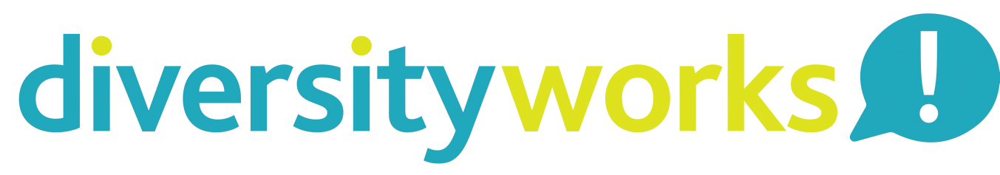

<!DOCTYPE html PUBLIC "-//W3C//DTD HTML 4.01//EN">

<html lang="en">
  <head profile="http://www.w3.org/2006/03/hcard">
    <title>DiversityWorks - Coming Soon</title>
	<link href="https://fonts.googleapis.com/css?family=Caveat|Open+Sans:300" rel="stylesheet">
	<link rel="shortcut icon" href="favicon.png">
    
  </head>

  <body>
    

      

        
        DiversityWorks by Community Corporate Coming Soon.
	    
        For enquiries visit <a href="https://www.communitycorporate.com.au/">communitycorporate.com.au</a>.
      

    

  </body>
</html>
